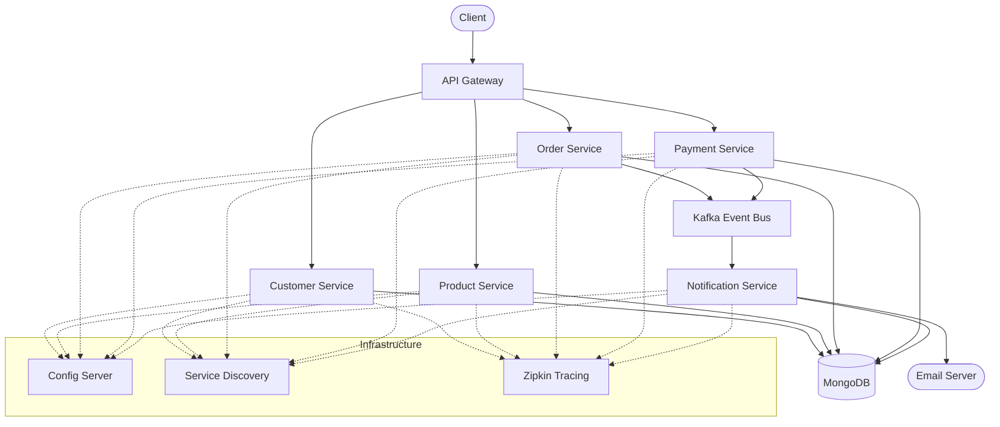

# E-Commerce Microservices Application

A modern, scalable e-commerce backend system built with Spring Boot microservices architecture. This project demonstrates best practices in building distributed systems with features like event-driven architecture, service discovery, centralized configuration, and distributed tracing.

## Architecture Overview

### System Architecture


The application is built using a microservices architecture with the following components:

- **API Gateway**: Entry point for all client requests, handles routing and load balancing
- **Config Server**: Centralized configuration management
- **Discovery Service (Eureka)**: Service registry and discovery
- **Core Services**:
    - Customer Service: Manages customer data and addresses
    - Product Service: Handles product catalog and inventory
    - Order Service: Processes customer orders
    - Payment Service: Manages payment transactions
    - Notification Service: Handles email notifications

### System Flow


### Event-Driven Architecture


The system uses Apache Kafka for asynchronous communication between services:
- Order and Payment events are published to dedicated Kafka topics
- Notification service consumes events to send email confirmations
- Ensures loose coupling and scalability

### Domain Model


## Key Features

- **Microservices Architecture**
    - Independent, loosely coupled services
    - Service discovery using Eureka
    - Centralized configuration with Spring Cloud Config
    - API Gateway pattern for request routing

- **Event-Driven Design**
    - Asynchronous communication using Kafka
    - Event sourcing for order and payment events
    - Scalable notification system

- **Data Management**
    - Database per service pattern
    - MongoDB for flexible data storage
    - Data consistency patterns

- **Monitoring & Tracing**
    - Distributed tracing with Zipkin
    - Service health monitoring
    - Centralized logging

## Technical Stack

- **Framework**: Spring Boot, Spring Cloud
- **Service Discovery**: Eureka Server
- **Configuration**: Spring Cloud Config
- **Database**: MongoDB
- **Message Broker**: Apache Kafka
- **API Gateway**: Spring Cloud Gateway
- **Monitoring**: Zipkin
- **Build Tool**: Gradle
- **API Documentation**: SpringDoc OpenAPI (Swagger)

## Project Structure

```
.
├── config-server/          # Centralized configuration service
├── discovery/             # Eureka service discovery
├── gateway/              # API Gateway service
├── customer/             # Customer management service
├── product/             # Product catalog service
├── order/               # Order processing service
├── payment/             # Payment processing service
└── notification/        # Notification service
```

## Getting Started

### Prerequisites

- JDK 17 or later
- Docker and Docker Compose
- Gradle 7.x
- MongoDB
- Apache Kafka

### Local Development Setup

1. Start infrastructure services:
```bash
docker-compose up -d
```

2. Start the config server:
```bash
cd config-server
./gradlew bootRun
```

3. Start the Eureka server:
```bash
cd discovery
./gradlew bootRun
```

4. Start core services (in any order):
```bash
cd <service-name>
./gradlew bootRun
```

### API Documentation

Once the services are running, you can access the API documentation at:
- Gateway Swagger UI: http://localhost:8080/swagger-ui.html
- Individual service Swagger UIs: http://localhost:<service-port>/swagger-ui.html

## Service Ports

- Config Server: 8888
- Discovery Server: 8761
- API Gateway: 8080
- Customer Service: 8081
- Product Service: 8082
- Order Service: 8083
- Payment Service: 8084
- Notification Service: 8085

## License

This project is licensed under the MIT License - see the [LICENSE](LICENSE) file for details.